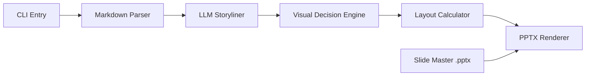

# present-md Implementation Plan

## Goal
Build an automated pipeline that converts Markdown → PPTX using an "Infographic-First" approach, with Docker support for easy setup.

## Architecture Overview



## Tech Stack

| Component | Technology | Rationale |
|-----------|-----------|-----------|
| Language | Python 3.11+ | Best PPTX ecosystem |
| CLI | Click | Clean CLI framework |
| Markdown Parsing | mistune | Fast, extensible |
| LLM | OpenAI GPT-4o | Storylining + visual decisions |
| PPTX | python-pptx | Industry standard |
| Containerization | Docker + docker-compose | Easy one-command setup |

## Project Structure

```
present-md/
├── Dockerfile
├── docker-compose.yml
├── requirements.txt
├── .env.example
├── README.md
├── Task.md
├── docs/PROJECT_KNOWLEDGE.md
├── Guidelines/                    # (existing reference files)
├── src/
│   └── present_md/
│       ├── __init__.py
│       ├── __main__.py            # python -m present_md
│       ├── cli.py                 # Click CLI
│       ├── pipeline.py            # Main orchestrator
│       ├── parser/
│       │   ├── __init__.py
│       │   └── md_parser.py       # Markdown → structured data
│       ├── storyliner/
│       │   ├── __init__.py
│       │   └── engine.py          # LLM-based storylining
│       ├── visual/
│       │   ├── __init__.py
│       │   ├── decision.py        # "Can this be visualized?" gate
│       │   └── charts.py          # Chart/table generators
│       ├── layout/
│       │   ├── __init__.py
│       │   └── grid.py            # Grid system, margins, spacing
│       └── renderer/
│           ├── __init__.py
│           ├── template.py        # Slide Master reader
│           └── builder.py         # PPTX assembly
├── input/                         # Drop .md + template here
├── output/                        # Generated .pptx goes here
└── tests/
    └── test_pipeline.py
```

## Proposed Changes

---

### Docker & Configuration

#### [NEW] Dockerfile
- Python 3.11-slim base image
- Install dependencies from requirements.txt
- Set working directory, entrypoint

#### [NEW] docker-compose.yml
- Service `present-md` with volume mounts for `input/` and `output/`
- Environment variable passthrough for `OPENAI_API_KEY`

#### [NEW] .env.example
- `OPENAI_API_KEY=your-key-here`
- `OPENAI_MODEL=gpt-4o`

#### [NEW] requirements.txt
- python-pptx, mistune, click, openai, python-dotenv, Pillow

---

### Module 1: CLI & Pipeline Orchestrator

#### [NEW] src/present_md/cli.py
- Click-based CLI: `present-md convert --input file.md --template master.pptx --output result.pptx`
- Validates inputs, loads env, calls pipeline

#### [NEW] src/present_md/pipeline.py
- Orchestrates: parse → storyline → visual decisions → layout → render
- Error handling and logging throughout

---

### Module 2: Markdown Parser

#### [NEW] src/present_md/parser/md_parser.py
- Uses mistune to parse markdown into AST
- Extracts: sections (by headers), tables, lists, paragraphs, embedded images
- Builds a `Document` data structure with typed content blocks

---

### Module 3: LLM Storyliner

#### [NEW] src/present_md/storyliner/engine.py
- Takes parsed document → sends to GPT-4o with structured prompt
- Returns a `SlideOutline` (10-15 slides, each with: title, key_message, content_type, content_data)
- Enforces: 1 key message per slide, Title → Agenda → Exec Summary → Sections → Conclusion flow

---

### Module 4: Visual Decision Engine

#### [NEW] src/present_md/visual/decision.py
- For each slide, evaluates: "Can this be visualized?"
- Tags content as: infographic, chart, table, process_flow, timeline, comparison, or text_only
- Enforces max 6-8 lines for text fallback

#### [NEW] src/present_md/visual/charts.py
- Generates native python-pptx charts (bar, pie, line, area) from tabular data
- Generates formatted tables with trend emphasis

---

### Module 5: Layout Calculator

#### [NEW] src/present_md/layout/grid.py
- Fixed grid system with configurable slide dimensions
- Margin enforcement, padding calculations
- Element positioning with snap-to-grid
- Baseline alignment helpers

---

### Module 6: PPTX Renderer

#### [NEW] src/present_md/renderer/template.py
- Reads Slide Master `.pptx` → extracts colors, fonts, backgrounds, layouts
- Builds a `ThemeConfig` object

#### [NEW] src/present_md/renderer/builder.py
- Assembles final PPTX using python-pptx
- Applies theme, positions elements via grid system
- Generates infographic shapes, charts, tables programmatically

---

## Verification Plan

### Automated Tests
- Unit tests for each module
- Integration test: end-to-end with Accenture sample (smallest)

### Manual Verification
- Run against all 3 sample files, compare with reference outputs
- Validate all 24 test cases don't crash
- Open outputs in PowerPoint, Google Slides, LibreOffice
